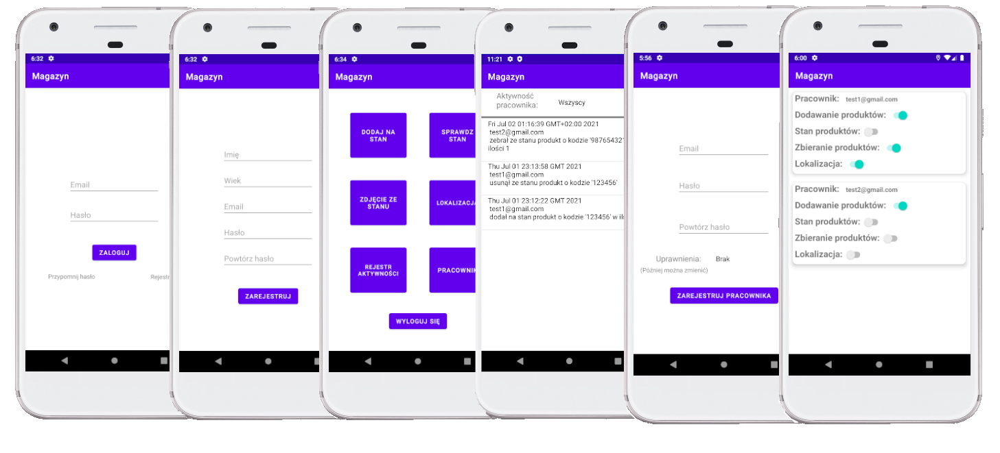
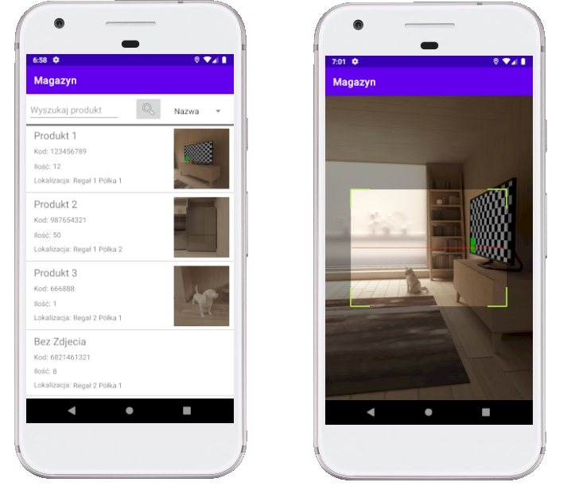

# Magazyn - Warehouse app
Aplikacja mobilna ze zdalną bazą danych do zarządzania powierzchnią magazynową - Mobile application with remote database for warehouse space management.

## Table of Contents
* [General Info](#general-information)
* [Languages and Tools](#languages-and-tools)
* [Features](#features)
* [Screenshots](#screenshots)

## General Information
Multifunction barcode scanner on your phone. Control and manage your products in the warehouse, store or have everything organized in your home. Create employee accounts and control the activities in the warehouse.

## Languages and Tools
* Java
* Android Studio
* Firebase
* Firebase Realtime Database
* ZXing

## Features
* Login and registration system 
* Product management (Adding, editing, deleting, collecting) 
* Adding a product picture
* Checking products in stock 
* Product Search
* Barcode scanning 
* Visualize the layout of shelves in a warehouse
* Activity log 
* Creating an employee account
* Employee Account Management

## Screenshots

### Scanning:

